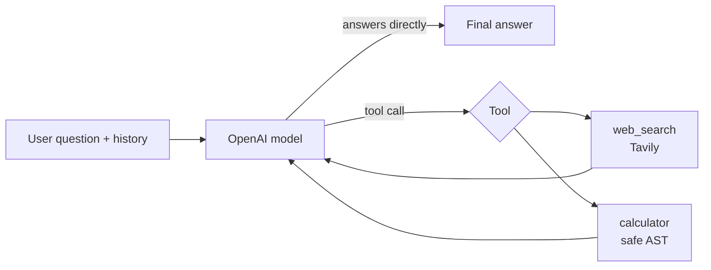

# simple-react-agent

A small, readable **ReAct chatbot** built with **LangGraph** and **Streamlit**. For each question the agent decides on its own whether to:

- **answer from its own knowledge** (explanations, concepts, stable facts),
- **search the web with Tavily** (current events, "latest" anything, facts that need a source), or
- **use a calculator** (arithmetic, percentages, numeric questions).

It can also **combine tools**, for example searching for a number and then calculating with it. There is no keyword routing and no tool picker: the model chooses, guided by a system prompt and clear tool descriptions. The project is meant for learning, so the code is small and commented.

## How the agent chooses

The agent follows the ReAct pattern (reason, act, observe) as a LangGraph loop:



1. The model receives the system prompt ([src/prompts.py](src/prompts.py)), the conversation so far, and two tool descriptions.
2. It either answers directly or asks to call a tool. **Model knowledge is the default**: no tool is called when none is needed.
3. LangGraph runs the requested tool and passes the result back to the model, which decides again: answer, or call another tool.
4. Each question is bounded: at most **6 model calls** and **8 tool calls**, plus a graph recursion limit as a backstop ([src/agent.py](src/agent.py)).

The system prompt also tells the agent to ask a clarifying question when essential information is missing, never to invent tool results, to treat web content as untrusted data (not instructions), and to cite web sources as clickable links.

The UI shows brief tool activity ("🔎 Searching the web", "🧮 Using calculator") and a **Tool details** panel with each tool's input and a short result preview. It never requests or shows the model's private reasoning.

## Technology stack

| Purpose | Choice |
| --- | --- |
| Language | Python 3.12 |
| Project and environment management | [uv](https://docs.astral.sh/uv/) (`pyproject.toml` + `uv.lock`) |
| Agent loop | [`langchain.agents.create_agent`](https://docs.langchain.com/oss/python/langchain/agents) (LangChain 1.x, runs on LangGraph) |
| Loop limits | `ModelCallLimitMiddleware`, `ToolCallLimitMiddleware` |
| Model | OpenAI via `langchain-openai` (`ChatOpenAI`, Responses API) |
| Web search | Tavily (`tavily-python`) |
| UI | Streamlit |
| Config | Environment variables / `.env` (`python-dotenv`) |
| Tests | pytest, with a scripted fake model and Streamlit's `AppTest` (no API calls) |

The default model is **`gpt-6-luna`**, OpenAI's cost-efficient model with function calling (checked against [OpenAI's model docs](https://developers.openai.com/api/docs/models) in September 2026). For harder questions you can set `OPENAI_MODEL=gpt-6-sol`. The app uses the Responses API because OpenAI documents it as the endpoint for function calling with these reasoning models.

## Folder structure

```text
simple-react-agent/
├── app.py                  # Streamlit chat UI
├── src/
│   ├── __init__.py
│   ├── agent.py            # Builds the agent; streaming, tool-activity, and error helpers
│   ├── prompts.py          # System prompt: when to answer directly vs. use tools
│   ├── config.py           # Loads and validates environment variables; logging setup
│   └── tools/
│       ├── __init__.py
│       ├── search.py       # Tavily search: timeouts, retries, capped output
│       └── calculator.py   # Safe AST-based calculator (no eval/exec)
├── tests/
│   ├── conftest.py         # Scripted fake chat model shared by the tests
│   ├── test_calculator.py
│   ├── test_search.py
│   ├── test_agent.py
│   └── test_app.py         # Headless Streamlit UI tests
├── .streamlit/config.toml  # Hides tracebacks in the browser; disables usage stats
├── .env.example            # Template for your .env
├── .python-version         # Python version for uv (3.12)
├── pyproject.toml          # Project metadata and dependencies
├── uv.lock                 # Exact, reproducible dependency versions
├── requirements.txt        # pip-compatible export of uv.lock
├── LICENSE
└── README.md
```

## Prerequisites

- [uv](https://docs.astral.sh/uv/getting-started/installation/). uv installs Python 3.12 for you if it is missing.
- An **OpenAI API key** with access to a tool-calling model: <https://platform.openai.com/api-keys>
- A **Tavily API key**: <https://app.tavily.com>

Install uv:

```bash
# macOS / Linux
curl -LsSf https://astral.sh/uv/install.sh | sh
# or, on macOS with Homebrew
brew install uv
```

```powershell
# Windows (PowerShell)
powershell -ExecutionPolicy ByPass -c "irm https://astral.sh/uv/install.ps1 | iex"
```

Restart your terminal afterwards, then check with `uv --version`.

## Setup

### 1. Get the code

```bash
git clone https://github.com/mlbala/simple-react-agent.git
cd simple-react-agent
```

### 2. Create the virtual environment and install dependencies

```bash
uv sync
```

`uv sync` reads `.python-version`, `pyproject.toml`, and `uv.lock`. It creates a `.venv/` folder with Python 3.12 and installs the exact locked versions, including the dev tools (pytest). The same command works on macOS, Linux, and Windows.

With uv you don't need to activate the environment: prefix commands with `uv run` (for example, `uv run streamlit run app.py`). If you prefer to activate it:

```bash
# macOS / Linux
source .venv/bin/activate
```

```powershell
# Windows (PowerShell)
.venv\Scripts\Activate.ps1
# Windows (cmd.exe)
.venv\Scripts\activate.bat
```

Run `deactivate` to leave the environment.

<details>
<summary>Without uv (plain pip)</summary>

`requirements.txt` is exported from `uv.lock` for pip users. Use Python 3.12:

```bash
# macOS / Linux
python3.12 -m venv .venv
source .venv/bin/activate
pip install -r requirements.txt pytest
```

```powershell
# Windows (PowerShell)
py -3.12 -m venv .venv
.venv\Scripts\Activate.ps1
pip install -r requirements.txt pytest
```

Then drop the `uv run` prefix from the commands below.
</details>

### 3. Configure environment variables

```bash
cp .env.example .env        # Windows: copy .env.example .env
```

Edit `.env`:

```dotenv
OPENAI_API_KEY=sk-...          # required
OPENAI_MODEL=gpt-6-luna        # optional; defaults to gpt-6-luna
TAVILY_API_KEY=tvly-...        # required
# LOG_LEVEL=INFO               # optional: DEBUG, INFO, WARNING, ERROR
```

Environment variables that are already set in your shell take precedence over `.env`. `.env` is ignored by git, so never commit real keys. If a required key is missing, the app shows a message naming it instead of starting the chat.

## Run the app

```bash
uv run streamlit run app.py
```

(or `streamlit run app.py` with the environment activated). Open <http://localhost:8501>.

To run the tests first and start the app only if they pass:

```bash
# macOS / Linux / Windows cmd
uv run pytest && uv run streamlit run app.py
```

```powershell
# Windows PowerShell 5.1 (no && support)
uv run pytest; if ($?) { uv run streamlit run app.py }
```

The tests don't need your `.env` or API keys (see [Run the tests](#run-the-tests)).

Use the **example questions** in the sidebar or type your own. **Clear chat** resets both the visible conversation and the context sent to the agent.

## Example prompts

| Prompt | Expected behaviour |
| --- | --- |
| What is a Python decorator? | Answers directly, no tools |
| What are the latest developments in AI? | Searches the web and cites sources |
| What is 18% of 12,500? | Uses the calculator (`0.18 * 12500`) |
| What is the current population of Japan, and what is 2% of it? | Searches, then calculates |
| *(after the decorator question)* Show me an example with arguments. | Uses the conversation context |
| How much is a 15% tip on $86.40, split between 3 people? | Uses the calculator |
| Convert it. | Asks a clarifying question |

## Run the tests

```bash
uv run pytest
```

The suite makes **no network or paid API calls** and ignores your `.env`. OpenAI is replaced by a scripted fake chat model and Tavily by a fake client. Useful options: `-v` lists each test, `-x` stops at the first failure, and `uv run pytest tests/test_calculator.py` runs a single file. It covers:

- **Calculator**: arithmetic, precedence and parentheses, decimals, percentages, division by zero, invalid input, rejection of unsafe code (function calls, attributes, names, imports), and rejection of expensive expressions (huge exponents, results, length, nesting).
- **Search**: result formatting and size caps, empty results, missing key, auth and rate-limit errors (not retried), transient errors (retried with backoff, bounded).
- **Agent**: direct answers, calculator and search tool execution, search followed by calculation, follow-up context, honest tool-failure reporting, the loop limit, and safe error messages.
- **UI** (Streamlit `AppTest`): startup, missing-config message, tool labels and details, follow-ups, Clear chat, example buttons, no duplicate messages on rerun, and session isolation.

## Managing dependencies

```bash
uv add <package>             # add a runtime dependency (updates pyproject.toml and uv.lock)
uv add --dev <package>       # add a development-only dependency
uv lock --upgrade            # upgrade locked versions within the allowed ranges
uv export --no-dev --no-hashes --no-emit-project -o requirements.txt   # refresh requirements.txt
```

Commit `pyproject.toml`, `uv.lock`, `.python-version`, and `requirements.txt` together.

## Troubleshooting

| Symptom | Fix |
| --- | --- |
| `uv: command not found` | Install uv (see Prerequisites) and open a new terminal. |
| "Configuration needed. Missing required setting(s): …" | Create `.env` from `.env.example` and fill in the named keys, then restart the app. |
| "OpenAI rejected the API key" | Check `OPENAI_API_KEY` and that it belongs to an active project. |
| "The configured OpenAI model was not found" or "cannot use this model" | Set `OPENAI_MODEL` to a model your project can access, e.g. `gpt-6-luna` or `gpt-6-sol`. |
| "OpenAI rejected the request…" | The model may not support tool calling. Use one of the models above. |
| "OpenAI rate limit or quota reached" | Wait and retry, or check billing and usage limits in the OpenAI dashboard. |
| Answer says web search failed | Check `TAVILY_API_KEY`, your Tavily credits, and your network connection. Details are in the terminal log. |
| "The assistant took too many steps…" | The question hit the per-turn loop limit. Ask something more specific. |
| `ModuleNotFoundError: No module named 'src'` | Run commands from the project root. |
| Port 8501 already in use | `uv run streamlit run app.py --server.port 8502` |

Application logs (tool calls, timings, failures) are printed in the terminal running Streamlit. Set `LOG_LEVEL=DEBUG` for more detail. The app does not log API keys, conversation text, or tool inputs. Unexpected failures are logged with a traceback so you can debug them. The browser only shows short, safe error messages.

## Limitations

- **Session-only history.** The conversation lives in Streamlit session state. Refreshing the page, clicking Clear chat, or restarting the app loses it, and nothing is stored on disk.
- **API costs.** Every question makes at least one OpenAI call, and tool use adds more (up to 6 model calls per question). Each web search uses Tavily credits. Watch your usage dashboards.
- **Growing context.** The full conversation, including tool results, is sent every turn. Very long chats cost more and may eventually hit context limits. Use Clear chat to start fresh.
- **Model judgment.** The model usually picks the right tool, but it can sometimes skip a search or search unnecessarily. Web snippets can be outdated or wrong, and only snippets are read, not full pages.
- **Calculator scope.** Supports `+ - * / **`, parentheses, and decimals, with 28 significant digits. There are no functions or variables (use `x ** 0.5` for square roots).
- **No streaming of answer text.** Tool activity updates live, but the answer appears once it is complete.
- **Local learning project.** There is no authentication or rate limiting for app users. Don't expose it publicly as-is.

## License

MIT. See [LICENSE](LICENSE).
